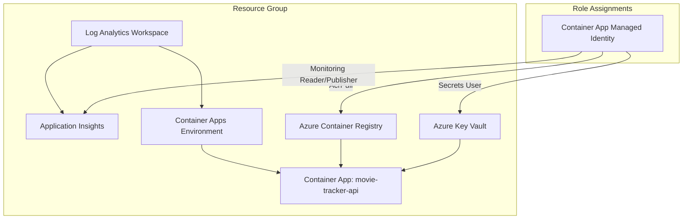

# Movie Tracker API

Movie Tracker API is a .NET 10 Web API that uses the Microsoft Agent Framework with Azure OpenAI and TMDb to answer movie-related questions. It ships with Azure Bicep infrastructure for deployment to Azure Container Apps.

## Highlights

- .NET 10 Web API with minimal hosting
- Microsoft Agent Framework agents wired to Azure OpenAI
- TMDb integration for live movie data
- Azure Container Apps deployment via Bicep
- Observability with Application Insights + Log Analytics

## Architecture (Bicep)

The infrastructure is modeled in [infrastructure/main.bicep](infrastructure/main.bicep) and composed of smaller modules. The diagram below mirrors how the resources are wired.



## Repository Layout

```
MovieTracker.Api/          # ASP.NET Core Web API
infrastructure/            # Azure Bicep templates + deploy scripts
movie-tracker-api.slnx     # Solution
```

## API Overview

### Endpoints

- `POST /Ask` - Sends a user question to the configured agent and returns a response.
- `GET /weatherforecast` - Sample endpoint from the default template.
- `GET /health` - Liveness probe.
- `GET /health/ready` - Readiness probe.
- `GET /version` - Build metadata.

### Agents and Tools

The API wires multiple agents:

- Movie assistant agent for general movie Q&A.
- Date/time agent with utilities for relative date ranges.
- TMDb agent that uses `TMDbLib` to search, discover, and fetch trailers.

These are configured in `Program.cs` and backed by tool classes in `MovieTracker.Api/Tools`.

### Configuration

Configuration is read from `appsettings.json` and environment variables. The Azure OpenAI section expects:

- `AzureOpenAI:Endpoint`
- `AzureOpenAI:ApiKey`
- `AzureOpenAI:DeploymentName`

TMDb uses:

- `TheMovieDB:Api-Key`

Use user-secrets or environment variables for local development.

## Local Development

```bash
dotnet restore MovieTracker.Api/MovieTracker.Api.csproj
dotnet run --project MovieTracker.Api/MovieTracker.Api.csproj
```

OpenAPI is available at `/openapi/v1.json` in Development.

## Infrastructure Deployment

Quick start using the PowerShell script:

```powershell
cd infrastructure
./deploy.ps1 -ResourceGroup RG-MovieTracker-Demo -Location westus3
```

Or use the bash script:

```bash
cd infrastructure
./deploy.sh demo RG-MovieTracker-Demo
```

## License

MIT
